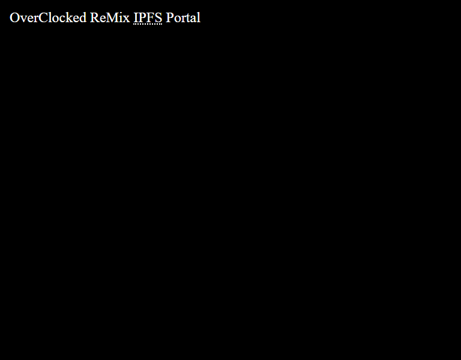

# Proof of concept for browsing & streaming OC ReMix albums via IPFS.

## Build
1) `npm install`
2) `gulp cache-ipfs-tree-as-json` - this may take multiple attempts
3) `gulp`

## Browse
Use any http server of your choice, open in a recent/modern browser.

## Optional Steps
* Install [IPFS companion](https://github.com/ipfs-shipyard/ipfs-companion) (
	this would allow you to fetch content from your local IPFS node,
	rater than using the IPFS API)
